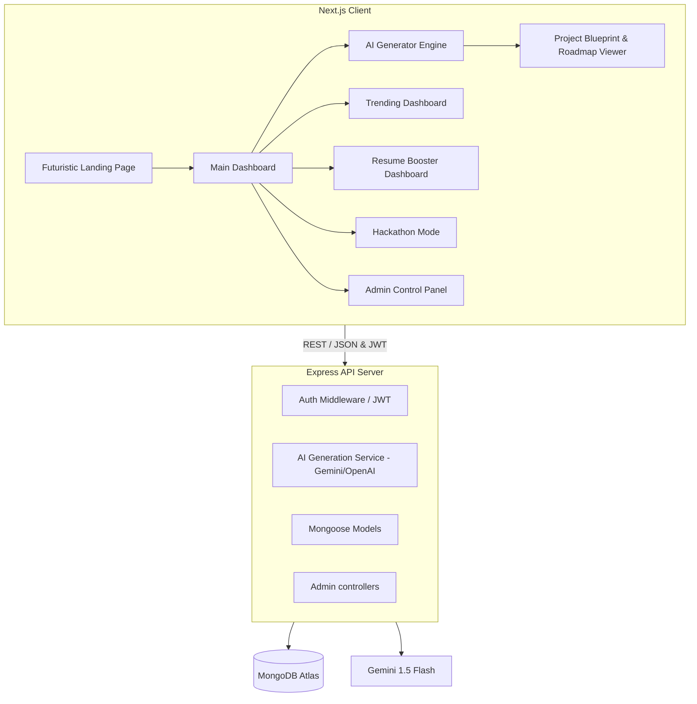

# 🚀 AI Project Idea Generator | NextGen Career Navigator

> **Synthesize premium, startup-level software blueprints, interactive development roadmaps, and resume-boosting highlights instantly.** 

This platform is a production-ready, highly interactive, and futuristic AI-powered application designed to help developers, students, researchers, and hackathon participants discover and plan unique, trending project ideas.

---

## ✨ Primary Features

1. **AI Synthesis Engine:** Multi-step parameter wizard compiling Skills, Interests, Tech Stack, Duration, and Team Sizes into rich structured JSON blueprints.
2. **SVG Architecture Flow Diagrams:** Sleek, interactive vector mappings of databases, servers, and clients with animated flowing neon dash indicators.
3. **Week-by-Week Roadmap Checklists:** Interactive progress trackers calculating percentage completions as you tick off milestones.
4. **Resume Booster & Metrics:** Radar skill fit graphs (via Recharts), copy-paste bullet highlight templates, and interview prep guides.
5. **Hackathon Mode:** Overclocked synthesis layers outputting stripped, high-innovation MVPs within seconds.
6. **AI Mentor Chatbot:** Floating AI coach giving real-time advice on database design, performance tuning, and deployments.
7. **Admin Operations Panel:** Operational stat tracking, live audit logs, and dynamic sliders to calibrate AI instructions on the fly.
8. **Sandbox Fallback:** Highly resilient offline support utilizing pre-built cybernetic templates and local-storage syncing if MongoDB/Gemini APIs are offline.

---

## 🏗️ Monorepo Architecture



---

## 🛠️ Technology Stack

* **Frontend Client:** Next.js (App Router, Tailwind CSS, TypeScript, Framer Motion, Recharts, Lucide Icons)
* **Backend API:** Node.js, Express.js, TypeScript, Mongoose, JWT authentication
* **Database System:** MongoDB Atlas / Local MongoDB
* **Generative Core:** Google Gemini 1.5 Flash API (via `@google/generative-ai`)

---

## 🚀 Getting Started

### 1. Prerequisites
- **Node.js:** v18.0.0 or higher
- **npm:** v9.0.0 or higher

### 2. Environment Configurations
Create a `.env` file in the root directory:
```env
PORT=5000
MONGODB_URI=mongodb://127.0.0.1:27017/nextgen_project_generator
JWT_SECRET=nextgen_projector_secret_jwt_key_2026_dev

# AI Engine API Key (Optional: fallbacks to Sandbox simulator if blank!)
GEMINI_API_KEY=your_gemini_api_key_here

NEXT_PUBLIC_API_URL=http://localhost:5000/api
```

### 3. Installation
Install dependencies across both client and server:
```bash
# Installs workspace dependencies simultaneously
npm run install:all
```

### 4. Running the Workspace
Boot up the concurrent hot-reloaded development servers:
```bash
# Starts Node Express and NextJS together
npm run dev
```
- **Frontend Panel:** Available at [http://localhost:3000](http://localhost:3000)
- **Backend API Server:** Listening on [http://localhost:5000](http://localhost:5000)

---

## 📄 License

This workspace is licensed under the MIT License.