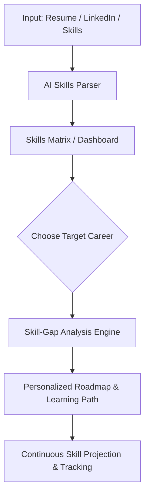

# 🚀 NextGen-Projector

> **Your AI-Powered Career Navigator.** Analyze your current skill set, forecast future job roles, identify critical skill gaps, and build dynamic, personalized learning paths to achieve your dream career.

---

## 🌟 What is NextGen-Projector?

**NextGen-Projector** is an intelligent, educational, and career-growth forecasting platform. Think of it as a **GPS for your career**. 

Instead of guessing what skills you need next or which certifications will help you get promoted, NextGen-Projector utilizes advanced AI to map your starting point, project future job trajectories, and highlight the fastest paths to success.

---

## ✨ Key Features

*   **📊 Interactive Skill Mapper:** Import your resume, connect your LinkedIn, or take a quick assessment to generate an interactive, visual 3D skills profile.
*   **🔮 Career Trajectory Projection:** Explore "what-if" career paths. See how transitioning from *Software Engineer* to *Product Manager* or *AI Specialist* looks over 1, 3, or 5 years.
*   **🧩 Dynamic Skill-Gap Analysis:** Compare your current skills directly with real-time job market requirements to instantly highlight what you're missing.
*   **🗺️ Smart Learning Roadmaps:** Get automated, curated learning paths containing recommended courses, open-source projects, and reading materials tailored to your pace.
*   **📈 Job Market Trend Engine:** Stay ahead of the curve with projected job demand, salary trends, and emerging industry-critical technologies.

---

## 🛠️ How It Works



1.  **Input:** Provide your current background, projects, and target role.
2.  **Analyze:** The platform parses your experience and benchmarks it against thousands of industry job descriptions.
3.  **Project:** NextGen-Projector maps out multiple chronological steps, identifying the precise skills and certifications needed.
4.  **Learn:** Dive into interactive, weekly roadmaps to systematically close your knowledge gaps.

---

## 💻 Tech Stack (Proposed)

*   **Frontend:** React.js / Next.js, Tailwind CSS (for modern, responsive, and glassmorphic UI), Framer Motion (for smooth animations), Recharts (for skills visualization).
*   **Backend:** Python (FastAPI) or Node.js (Express) – highly optimized for prompt engineering and heavy data processing.
*   **Database:** PostgreSQL (for structured user profiles) & Redis (for fast caching of market trends).
*   **AI/ML Integration:** Gemini 1.5 Pro / Claude 3.5 Sonnet / OpenAI GPT-4o for dynamic path generation and resume parsing.

---

## 🚀 Getting Started

*(Instructions will be updated as implementation progresses)*

### Prerequisites
- Node.js (v18+)
- Python (v3.10+)

### Installation

1.  **Clone the repository:**
    ```bash
    git clone https://github.com/Techside-Pragyan/NextGen-Projector.git
    cd NextGen-Projector
    ```

2.  **Install dependencies:**
    ```bash
    # For Frontend
    npm install
    
    # For Backend
    pip install -r requirements.txt
    ```

3.  **Set up Environment Variables:**
    Create a `.env` file in the root directory:
    ```env
    DATABASE_URL=your-database-url
    GEMINI_API_KEY=your-gemini-api-key
    ```

4.  **Run the application:**
    ```bash
    npm run dev
    ```

---

## 🤝 Contributing

Contributions are welcome! If you have suggestions for improvement, feel free to open an issue or submit a pull request. Let's build the future of professional growth together.

## 📄 License

This project is licensed under the MIT License - see the [LICENSE](file:///c:/Users/pragy/Documents/GitHub/NextGen-Projector/LICENSE) file for details.