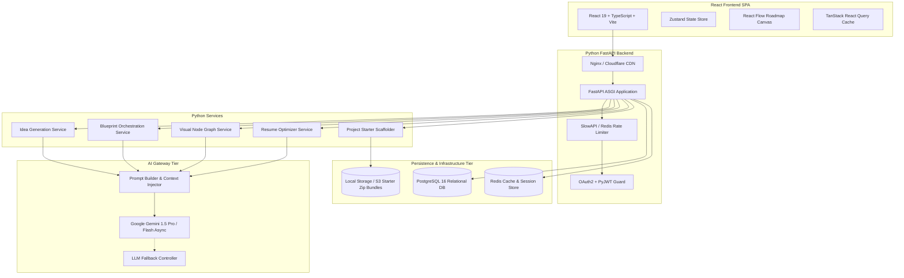

# 🏗️ High-Level Design (HLD)

**Project Name:** NextGen-Projector  
**Design Pattern:** Decoupled Single-Page Application (SPA) + Asynchronous API Gateway + Relational Persistence + External AI Engine.

---

## 1. High-Level Architecture Topology

---

## 2. Architectural Tiers & Responsibilities

### 2.1 Presentation Tier (React Frontend)
- **Component Hierarchy:** Modular architecture organized by feature domains (`features/matrix`, `features/roadmap`, `features/blueprint`, `features/community`, `features/resume`).
- **Interactive Canvas:** High-performance DAG node visualizer utilizing `@xyflow/react` for interactive pan/zoom and real-time node unlocking animations.
- **Server Communication:** Standard REST operations via Axios/Fetch and streaming Server-Sent Events (SSE) via native `EventSource` / `fetch-event-source`.

### 2.2 API & Gateway Tier (FastAPI Backend)
- **ASGI High-Throughput Server:** Non-blocking async event loop capable of managing long-lived SSE streaming connections.
- **Security & Authorization Middleware:** Validates JWT Bearer tokens, protects protected endpoints, and tracks per-user rate limits.
- **Input Sanitization & Validation:** Centralized Pydantic v2 schemas validating request structures before entering business logic.

### 2.3 Business Logic & AI Orchestrator Tier
- **Prompt Engineering & Context Engine:** Injects system requirements, schema constraints, few-shot enterprise patterns, and edge-case requirements into Gemini prompts.
- **Structured Output Guarantees:** Utilizes Gemini's structured JSON output mode to guarantee type-safe JSON returns matching Pydantic models.
- **Starter Kit Generator:** Compresses project file trees into in-memory `.zip` buffers using Python's `zipfile` module.

### 2.4 Data & Storage Tier
- **PostgreSQL 16 Database:** Primary persistence layer for user identities, ideas, deep blueprints, milestone states, and user progress.
- **Redis Cache:** Sub-millisecond caching for prompt queries and rate-limiting counters.
