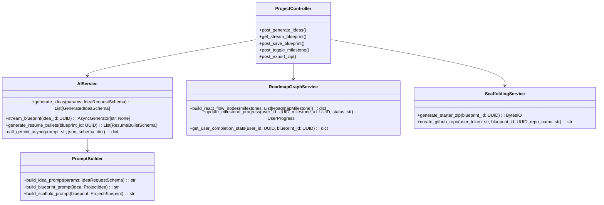

# 🔍 Low-Level Design (LLD)

**Project Name:** NextGen-Projector  
**Language:** Python 3.11+ / TypeScript  
**Backend Framework:** FastAPI + Pydantic v2 + SQLAlchemy 2.0  
**Frontend Framework:** React 19 + React Flow + Zustand  

---

## 1. Class & Service Architecture



---

## 2. Python Backend Pydantic Schemas

```python
import uuid
from enum import Enum
from typing import Any, Dict, List, Optional
from pydantic import BaseModel, Field


class DifficultyLevel(str, Enum):
    BEGINNER = "BEGINNER"
    INTERMEDIATE = "INTERMEDIATE"
    ADVANCED = "ADVANCED"
    STAFF_DISTRIBUTED = "STAFF_DISTRIBUTED"


class CareerGoal(str, Enum):
    FRONTEND_DEV = "FRONTEND_DEV"
    BACKEND_ENGINEER = "BACKEND_ENGINEER"
    FULLSTACK_ARCHITECT = "FULLSTACK_ARCHITECT"
    AI_ML_ENGINEER = "AI_ML_ENGINEER"
    DEVOPS_SRE = "DEVOPS_SRE"
    SYSTEMS_ENGINEER = "SYSTEMS_ENGINEER"


class IdeaRequestSchema(BaseModel):
    skills: List[str] = Field(..., min_items=1, example=["React", "Python", "PostgreSQL"])
    preferred_stack: List[str] = Field(default=[], example=["FastAPI", "React", "Redis"])
    difficulty: DifficultyLevel = DifficultyLevel.ADVANCED
    career_goal: CareerGoal = CareerGoal.FULLSTACK_ARCHITECT
    domain_interest: Optional[str] = Field(None, example="AI Agents & DevTools")
    time_commitment_weeks: Optional[int] = Field(4, ge=1, le=16)


class RecommendedTechStack(BaseModel):
    frontend: List[str]
    backend: List[str]
    database: List[str]
    ai_ml: Optional[List[str]] = []
    devops: List[str]


class GeneratedIdeaSchema(BaseModel):
    id: str = Field(default_factory=lambda: str(uuid.uuid4()))
    title: str
    tagline: str
    difficulty: DifficultyLevel
    match_score_percentage: int
    why_unique: str
    industry_relevance: str
    recommended_tech_stack: RecommendedTechStack
    key_features: List[str]
    estimated_completion_weeks: int


class CodeSnippetSchema(BaseModel):
    title: str
    language: str
    code: str


class MilestoneNodeSchema(BaseModel):
    id: str
    phase_number: int
    title: str
    description: str
    deliverable: str
    prerequisites: List[str]
    verification_criteria: List[str]
    code_snippets: List[CodeSnippetSchema]
    status: str = "LOCKED"  # LOCKED, AVAILABLE, IN_PROGRESS, COMPLETED


class ProjectBlueprintSchema(BaseModel):
    id: str
    idea_id: str
    system_architecture: Dict[str, Any]
    folder_structure: str
    database_schema: Dict[str, Any]
    api_specifications: List[Dict[str, Any]]
    edge_cases: List[Dict[str, str]]
    resume_bullets: List[str]
    milestones: List[MilestoneNodeSchema]
```

---

## 3. Frontend TypeScript Interfaces & State Model

```typescript
export interface UserState {
  user: UserProfile | null;
  token: string | null;
  isAuthenticated: boolean;
  setAuth: (user: UserProfile, token: string) => void;
  logout: () => void;
}

export interface WorkspaceState {
  activeIdea: GeneratedIdea | null;
  activeBlueprint: ProjectBlueprint | null;
  completedMilestoneIds: string[];
  setActiveIdea: (idea: GeneratedIdea) => void;
  setActiveBlueprint: (blueprint: ProjectBlueprint) => void;
  toggleMilestone: (milestoneId: string) => void;
}

export interface ReactFlowNodeData {
  phaseNumber: number;
  title: string;
  deliverable: string;
  status: 'LOCKED' | 'AVAILABLE' | 'IN_PROGRESS' | 'COMPLETED';
  onSelectNode: (nodeId: string) => void;
}
```
